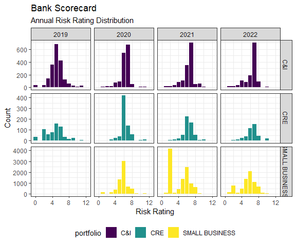

Scorecard Validation
================

## Introduction

The purpose of this project is to monitor and test the ongoing
performance of a client’s credit risk rating scorecards. The Bank’s risk
rating scorecards have been in place for over ten years, and the Bank
wants to understand whether the models have weakened over time or
whether the scorecards are still predictive on today’s loan borrowers.

Generally speaking, model performance for a credit risk scorecard
translates to: **does the scorecard correctly classify borrowers who
default on their loan as high risk prior to their default date?**

To accomplish this goal, there are a couple of questions we have to
answer as we analyze the risk rating data:

-   How do we identify whether a borrower has defaulted?

-   How do we identify which scorecard a borrower belongs to?

-   What metrics should we use to measure the model’s accuracy?

## Data Request

The client provides a SQL database containing monthly snapshots of each
account at a given point in time. The id columns are the fields
‘portfolio_date’ and ‘facility_id’, which identify the monthly snapshot
and account id for each observation in the database. The monthly
snapshots record both loan-level and borrower-level information for all
accounts.

The monthly snapshots contain the records for all accounts in the Bank’s
portfolio spanning 2014-2022:

``` r
cade_2014to2022 %>% 
  count(portfolio_date, scorecard) %>% 
  ggplot(aes(x = portfolio_date, y = n))+
  geom_bar(stat = "identity")+
  theme_bw()+
  xlab("Snapshot Date")+
  ylab("Count")
```

<!-- -->

Our data set is comprised of around \~20k accounts per snapshot.
However, the data frequency was not monthly as promised by the Bank,
rather we have quarterly snapshots from 12/31/2014 to 12/31/2021,
followed by monthly snapshots from 1/31/2022 to 6/30/2022.

Having monthly vs. quarterly data could potentially affect the scorecard
validation results. The reason we request snapshot data in the first
place is so we can track month-over-month changes in a borrower’s
default status. We want to be able to pinpoint exactly when a borrower
defaults.

Monthly data allows us to identify the first time a borrower goes
30/60/90 days past due. With quarterly data, we can still achieve that
goal, but our level of precision is lower.

Within our data, we have the following columns:

``` r
cade_2014to2022 %>% colnames() %>% tibble(df_colnames = .)
```

    ## # A tibble: 24 x 1
    ##    df_colnames                
    ##    <chr>                      
    ##  1 portfolio_date             
    ##  2 facility_id                
    ##  3 Call_Code                  
    ##  4 shadow_balance             
    ##  5 cmt_available              
    ##  6 Past_Due_in_Days           
    ##  7 Accural_Status.Non.Accrual.
    ##  8 Collateral_Code            
    ##  9 Collateral_Value           
    ## 10 scorecard                  
    ## # ... with 14 more rows

The columns are a mix of portfolio identifiers, customer-level data,
loan-level data and credit risk data:

| Column Name                 | Type                 | Description                                                  |
|-----------------------------|----------------------|--------------------------------------------------------------|
| portfolio_date              | Snapshot id          |                                                              |
| facility_id                 | Account id           |                                                              |
| Call_Code                   | Portfolio id         | Represents which portfolio a given account belongs to        |
| shadow_balance              | Loan information     | Loan balance                                                 |
| cmt_available               | Loan information     | Total Commitment Available                                   |
| Past_Due_in_Days            | Loan information     | Number of Days Past Due                                      |
| Accural_Status.Non.Accrual. | Loan information     | Accrual Status (Acrruing / Non-Accuing)                      |
| Collateral_Code             | Loan information     | Collateral Type                                              |
| Collateral_Value            | Loan information     | Collateral Value                                             |
| scorecard                   | Portfolio id         | Scorecard to which an account belongs                        |
| rr_classification           | Risk information     | Regulatory Risk Rating                                       |
| pd                          | Risk information     | Probability of Default Rating                                |
| pd_rate                     | Risk information     | Probability of Default Percent (%)                           |
| lgd                         | Risk information     | Loss Given Default Rating                                    |
| lgd_rate                    | Risk information     | Loss Given Default Percent (%)                               |
| current_credit_score        | Customer information | Guarantor FICO Score                                         |
| revolve_type                | Loan information     | Type of Line of Credit?                                      |
| loan_type                   | Loan information     | Term Loan or Line of Credit?                                 |
| Total_Deposit               | Customer information | Deposit Balance Customer has with Bank                       |
| On_Us_Deposit               | Customer information | Are Total Deposits \> 0 ?                                    |
| Credit_Limit                | Customer information | Total credit limit of all loans a customer has with the Bank |
| customer_state              | Customer information | Customer Location                                            |
| current_ltv                 | Loan information     | Current Loan to Value                                        |
| Loans_Num_Times_GT_30_PD    | Loan information     | \# of Time the loan has gone 30 days past due?               |

## Data Processing

The dataset contains 24 columns, but not all of which are necessary for
the scorecard validation. Based on discussions with the Bank to
understand their data, I’ve gathered the following information about
their dataset:

1.  Default is defined using two trigger criteria: 1) **Current Days
    Past Due \> 90** or 2) **Accrual Status == “NonAccrual”.** If either
    condition is met, the account is considered as in default.

2.  The Default Date is defined as the first month-end snapshot where a
    loan enters default.

3.  A borrowers risk rating is stored in the field, *’*pd’. The
    scorecard’s accuracy should be tested against the pd rating.

4.  The scorecard validation analysis should be segmented by risk rating
    scorecard using the field, *scorecard.* Each scorecard uses
    different risk factors, thus we should calculate each scorecard’s
    accuracy on an individual basis.

The additional data provided by the bank can be used for other test, but
for the performance calculation, I took the below subset of the data:

``` r
cade_2014to2022 %>% 
  select(facility_id, 
         portfolio_date,
         Accural_Status.Non.Accrual., 
         Past_Due_in_Days,
         scorecard,
         pd) %>% 
  glimpse()
```

    ## Rows: 801,425
    ## Columns: 6
    ## $ facility_id                 <chr> "1000539310", "1000539351", "1000539369", ~
    ## $ portfolio_date              <date> 2014-12-31, 2014-12-31, 2014-12-31, 2014-~
    ## $ Accural_Status.Non.Accrual. <chr> "Accruing", "Accruing", "Accruing", "Accru~
    ## $ Past_Due_in_Days            <dbl> 0, 0, 0, 0, 0, 0, 30, 0, 0, 0, 0, 0, 0, 0,~
    ## $ scorecard                   <chr> NA, NA, NA, NA, NA, NA, NA, NA, NA, NA, NA~
    ## $ pd                          <dbl> NA, NA, NA, NA, NA, NA, NA, NA, NA, NA, NA~

I reduced the number of columns from 24 to 6. The next data processing
task is considering whether there are any rows which need to be
excluded.

### Excluding NAs

Within our included fields, there is no value that would be considered
an outlier, so we don’t do any outlier treatments or filtering in this
analysis. The only reason for excluding an observation is if any of the
columns are NA. Below are the NA counts over time for each variable:

``` r
cade_2014to2022 %>% 
  select(facility_id, 
         portfolio_date,
         Accural_Status.Non.Accrual., 
         Past_Due_in_Days,
         scorecard,
         pd) %>% 
  group_by(portfolio_date) %>% 
  summarize(across(everything(), ~sum(is.na(.)))) %>% 
  pivot_longer(-portfolio_date) %>% 
  ggplot(aes(x = portfolio_date, y = value))+
  geom_line()+
  theme_bw() +
  facet_wrap(vars(name))+
  labs(x = "Snapshot Date", y = "NA Count")
```

<!-- -->

The fields ‘scorecard’ and ‘pd’ have a significant number of NAs,
indicating that many accounts were not rated with a scorecard or don’t
have a PD rating. All other columns are fully populated.

When discussing the NA issue with the Bank, the Bank indicated that it
started using its risk rating scorecards in 2018, and accounts prior to
2018 were not rated against the current scorecards.

FIS filtered out all NAs from the dataset, which shortened the sample
from 2014-2022 to 2018-2022, since ‘scorecard’ and ‘pd’ are required
fields for this analysis.

The number of accounts across the quarterly and monthly snapshots is
shown below for each of the Bank’s scorecards:

<!-- -->

With our dataset finalized, the final step in data processing is
identifying the defaulted accounts.

### Identifying Defaults

Using the two default criteria, **days past due \> 90** or **accrual
status = ‘NonAccrual’**, we can create a default flag to identify when
an account enters default.

Once we flag when one of those two criteria is met, the next step is to
consolidate our data by account number. We want to know when an account
first entered default so we can test whether the scorecard accurately
predicted the event *prior to it happening.*

The below table shows the frequency of defaulted accounts across the
snapshots. The default date for each account is the first snapshot in
which one of the two default criteria is triggered:

``` r
cade_default %>% 
  mutate(scorecard = def_scorecard) %>% 
  filter(is.na(scorecard) == FALSE) %>% 
  filter(scorecard %in% c("C&I",
                            "CRE",
                            "CONSUMER",
                            "SMALL BUSINESS")) %>%
  count(first_default_date, scorecard) %>% 
  ggplot(aes(x = first_default_date, y = n, fill = scorecard)) +
  geom_bar(stat = "identity", alpha = 0.7) +
  geom_point(aes(color = scorecard)) +
  theme_bw() +
  scale_fill_viridis_d() +
  scale_color_viridis_d() +
  xlab("Snapshot Date") +
  ylab("Default Count") +
  facet_grid(rows = vars(scorecard), scales = "free_y")+
  theme(strip.text.y = element_text(size = 7))
```

<!-- -->

## Annual Default Rate Analysis

The final step needed before we can measure model performance is to
restructure our dataset to calculate annual default rates. Default rates
cannot be calculated by simply dividing the number of defaults in a
month by the total number of observations that month for a few reasons.
If, for example, the Bank made an acquisition and onboarded thousands of
new loans into the portfolio, that would cause a simple division to
understate the default rate.

An acquisition is an extreme example, but the Bank’s portfolios are
fluid in nature - each month, new accounts are added and old account
roll off the books. Because of this dynamic, it’s important to control
for portfolio changes over time when evaluating model performance. A
commonly used technique to account for this is what’s called a
*closed-end analysis*:

-   At t= 0, a starting list of accounts is defined. In this analysis,
    the list of accounts consists of **all accounts rated by a given
    scorecard, which have never previously entered default.**

-   Over the next four quarterly snapshots (one year), we track whether
    any of these accounts enter default. If either default criteria is
    met, that account is flagged as a default observation.

-   The observed default rate for that year is defined as
     / count(Total)")
    .

-   We then compare whether an account defaults within the next calendar
    year to its risk rating at t = 0.

Since our finalized data sample spans 2018-2022, we calculated default
rates for 4 years. Our closed-end analysis picks a 6/30 annual snapshot
as the starting date, and then tracks whether any of those accounts
default over the next 12 months.

Each year’s healthy snapshot date and default measurement window is
outlined below:

| Year | Healthy Snapshot Date | Default Measurement Window |
|------|-----------------------|----------------------------|
| 2019 | 2018-06-30            | 2018-07-31 to 2019-06-30   |
| 2020 | 2019-06-30            | 2019-07-31 to 2020-06-30   |
| 2021 | 2020-06-30            | 2020-07-31 to 2021-06-30   |
| 2022 | 2021-06-30            | 2021-07-31 to 2022-06-30   |

Across the four years, we compared the number of defaults to the number
of healthy observations, yielding the annual observed default rate by
scorecard.

Overall, the default rate for the commercial scorecards (C&I and CRE)
were relatively low, while the consumer oriented models (Consumer and
Small Business) had higher observed default rates over the measurement
period.

| Portfolio      | Year | Healthy Count | Default Count | Annual Default Rate (%) |
|----------------|------|---------------|---------------|-------------------------|
| C&I            | 2019 | 1,946         | 1             | 0.05%                   |
| C&I            | 2020 | 1,543         | 17            | 1.12%                   |
| C&I            | 2021 | 1,436         | 6             | 0.42%                   |
| C&I            | 2022 | 1,264         | 5             | 0.40%                   |
| CRE            | 2019 | 653           | 1             | 0.155                   |
| CRE            | 2020 | 714           | 11            | 1.54%                   |
| CRE            | 2021 | 555           | 5             | 0.90%                   |
| CRE            | 2022 | 427           | 1             | 0.23%                   |
| Small Business | 2020 | 6,417         | 116           | 1.81%                   |
| Small Business | 2021 | 10,350        | 109           | 1.05%                   |
| Small Business | 2022 | 6,849         | 128           | 1.87%                   |
| Consumer       | 2020 | 19,650        | 265           | 1.35%                   |
| Consumer       | 2021 | 17,647        | 123           | 0.70%                   |
| Consumer       | 2022 | 15,434        | 103           | 0.67%                   |

Tracking the default rates over time, it is clear that the Bank as a
whole saw an uptick in defaults during the 2020 observation. That data
point measures defaults spanning July 2020 - June 2021, which coincides
with the COVID-19 pandemic, thus the elevated default rates is an
expected result.

<!-- -->

The annual default rate calculation has further reshaped our data from
monthly to annual portfolio snapshots. Once we define our portfolio as
of 6/30 each year, we then pull in a flag which identifies whether a
loan that is healthy as of 6/30 default within the next 12 months.

The final step in validating the scorecard’s performance is to compare
each account’s future default status to its rating as of 6/30 each year.

## Scorecard Validation

Our scorecard validation builds on the dataset used in the annual
default rate calculation. To understand the dataset, the below chart
shows the risk rating distribution for each 6/30 snapshot, by portfolio:

<!-- -->

The risk rating distribution is mostly normal for each portfolio across
the four years. The risk rating scale ranges from 1 to 12, with most
falling between 4-8.

The above chart shows the rating distribution for the C&I, CRE, and
Small Business scorecards. Notably, the Consumer scorecard distribution
is missing. This occurs because the Bank does not assign ratings to its
Consumer customers. The Consumer loans are assigned to the ‘Consumer’
scorecard, thus we can calculate an annual default rate, but we do not
have risk ratings for these loans, thus the scorecard accuracy testing
will be performed only on the other three scorecards.

### Future Default Rate by Risk Rating

The first test in understanding each scorecard’s performance is to
visualize the observed default rate by risk rating:

<!-- -->

As shown above, the higher risk ratings capture a large portion of the
future defaults. Across the four year time span, all scorecards have the
highest default rate among loans which they rated 10 and above. This is
an initial indication that the models are high performing as it shows
that the scorecards assign defaulted borrowers to high risk ratings.

To quantify this result, we use an ROC curve and Gini coefficient to
measure each scorecard’s performance across the included years. The Gini
coefficient is the metric upon which the scorecard’s are formally
evaluated by third party reviewers.

### Gini Coefficients / ROC Curves

The most common metric used to evaluate a risk rating scorecard is a
Gini coefficient, which can be derived from the scorecard’s Receiver
Operating Characteristic (ROC) curve. An ROC curve is a visual
representation of how well a classification model works. ROC Curves for
a credit rating model shows the percentage of defaults compared to the
percentage of all accounts.

With an ROC curve, the statistic that we track for each scorecard is the
Gini coefficient, which quantifies the area under the ROC curve (AUROC):


For this validation, I fit ROC curves and calculated Gini coefficients
for each scorecard on two levels of granularity:

-   **Annual ROC Curve** (uses the healthy and default observations
    exclusive to that year’s data)

-   **Cumulative ROC Curve** (aggregates the healthy and default
    observations across all years)

The metrics show how well the scorecards perform on a year-to-year basis
(whether the performance varies over time) and in aggregrate.

<!-- -->

Across the three risk rating scorecards, the calculated gini
coefficients show varied results:

-   **C&I Scorecard**: Cumulative Gini Coefficient = 57%

-   **CREIP Scorecard**: Cumulative Gini Coefficient = 91%

-   **Small Business Scorecard**: Cumulative Gini Coefficient = 36%

The CREIP Scorecard demonstrates excellent performance in both the
annual ROC curves and in the cumulative ROC curve. The scorecard is able
to identify defaults as high risk prior to the default occuring.

The C&I scorecard shows adequate performance on a cumulative basis with
a Gini Coefficient of 57%. While the overall performance is acceptable,
the annual ROC curves show worsening performance over time. Each annual
Gini coefficient is worse than the previous year’s.

Finally, the Small Business scorecard shows below average performance on
a cumulative basis with a Gini Coefficient of 36%. This low cumulative
performance is caused mostly by the model’s inability to identify
defaults in 2021/22.

With both the C&I and Small Business scorecard performing far below
average in 2021/22, it is worth looking into each scorecard’s inputs to
determine if there is a common root cause such as input data quality
that could be causing the deterioration in performance.
