## Company Background

GoalZone is a fitness club chain providing five types of fitness classes
in Canada. Finally, the fitness classes schedule is back to normal after
the COVID-19 restrictions are lifted. However, they have received many
complaints from the customers about having a hard time booking a fitness
class.

From initial analysis, the program operation team found out that the
fitness classes are always fully booked but are having a low attendance
rate per class. To improve this situation, they would like to increase
the class capacity for customers to sign up if a low attendance rate is
predicted.

## Customer Question

The operation manager has asked you to answer the following: - Can you
predict the attendance rate for each fitness class?

## Dataset

The dataset contains the attendance information for the class scheduled
this year so far. The data you will use for this analysis can be
accessed here: `"data/fitness_class.csv"`

<table>
<colgroup>
<col style="width: 22%" />
<col style="width: 77%" />
</colgroup>
<thead>
<tr class="header">
<th>Column Name</th>
<th>Criteria</th>
</tr>
</thead>
<tbody>
<tr class="odd">
<td>Day of Week</td>
<td>Character, the day of the week the class was scheduled, one of
values from “Mon” to “Sun”.</td>
</tr>
<tr class="even">
<td>Time</td>
<td>Character, the time of the day the class was scheduled, either “AM”
or “PM”.</td>
</tr>
<tr class="odd">
<td>Class Category</td>
<td>Character, the category of the fitness class, one of “Yoga”, “Aqua”,
“Strength”, “HIIT”, or “Cycling”.</td>
</tr>
<tr class="even">
<td>Days Before</td>
<td>Numeric, number of days the class stayed fully booked, maximum five
days.</td>
</tr>
<tr class="odd">
<td>Class Capacity</td>
<td>Numeric, maximum number of members can sign up for that class,
either 15 or 25. The class capacity being 26 needs to be updated to
25.</td>
</tr>
<tr class="even">
<td>Attendance</td>
<td>Numeric, number of members actually attended the class.</td>
</tr>
<tr class="odd">
<td>Average Age</td>
<td>Numeric, average age of the members signing up for that class.
Remove rows that average age is smaller than 14 because group fitness
class are for members aged 14 and order.</td>
</tr>
<tr class="even">
<td>Number of New Students</td>
<td>Numeric, number of new students signing up for this class.</td>
</tr>
<tr class="odd">
<td>Number of Members Over 6 months</td>
<td>Numeric, number of members signing up for the class have been
joining the club more than 6 months.</td>
</tr>
</tbody>
</table>

# Data Scientist Case Study Submission

Use this template to complete your analysis and write up your summary
for submission.

## Data Validation

To understand how best to approach the problem presented to us in the
case brief. we will start by evaluating the data quality and consistency
of our data. Our data validation process can be categorized into two
sections:

1.  Data Cleaning & Review
2.  Data Transformations

The output from the two data validation steps will be cleaned and
processed data frame that is ready for use in model development.

### Data Cleaning & Review

In the first step of our data validation process, we will:

-   Check for NAs

-   Confirm the issues in our data as stated in the brief:

    1.  Class Capacity should only equal 15 or 25

    2.  Classes with average age &lt; 14 (which should not be possible
        given the age limit on group classes)

    3.  The maximum value of Days Before should equal 5

We will use the skim function from the skimr package to review the
provided dataset:

    print(skimr::skim(df))

    ## ── Data Summary ────────────────────────
    ##                            Values
    ## Name                       df    
    ## Number of rows             765   
    ## Number of columns          9     
    ## _______________________          
    ## Column type frequency:           
    ##   character                3     
    ##   numeric                  6     
    ## ________________________         
    ## Group variables            None  
    ## 
    ## ── Variable type: character ────────────────────────────────────────────────────
    ##   skim_variable  n_missing complete_rate min max empty n_unique whitespace
    ## 1 day_of_week            0             1   3   3     0        7          0
    ## 2 time                   0             1   2   2     0        2          0
    ## 3 class_category         0             1   4   8     0        5          0
    ## 
    ## ── Variable type: numeric ──────────────────────────────────────────────────────
    ##   skim_variable  n_missing complete_rate  mean   sd   p0  p25 p50  p75 p100
    ## 1 class_capacity         0             1 17.5  4.37 15   15    15 25   26  
    ## 2 days_before            0             1  2.55 1.36  1    1     2  4    5  
    ## 3 attendance             0             1  9.56 3.90  4    7     9 11   21  
    ## 4 age                    0             1 29.1  5.91  8.3 25.3  29 33.2 48.8
    ## 5 new_students           0             1  5.92 1.79  1    5     6  7   11  
    ## 6 over_6_month           0             1  7.58 1.97  2    6     8  9   13  
    ##   hist 
    ## 1 ▇▁▁▁▃
    ## 2 ▇▅▅▅▂
    ## 3 ▇▇▆▁▂
    ## 4 ▁▃▇▃▁
    ## 5 ▂▆▇▃▁
    ## 6 ▁▅▇▅▂

    ## $character
    ## 
    ## ── Variable type: character ────────────────────────────────────────────────────
    ##   skim_variable  n_missing complete_rate min max empty n_unique whitespace
    ## 1 day_of_week            0             1   3   3     0        7          0
    ## 2 time                   0             1   2   2     0        2          0
    ## 3 class_category         0             1   4   8     0        5          0
    ## 
    ## $numeric
    ## 
    ## ── Variable type: numeric ──────────────────────────────────────────────────────
    ##   skim_variable  n_missing complete_rate  mean   sd   p0  p25 p50  p75 p100 hist
    ## 1 class_capacity         0             1 17.5  4.37 15   15    15 25   26   ▇▁▁…
    ## 2 days_before            0             1  2.55 1.36  1    1     2  4    5   ▇▅▅…
    ## 3 attendance             0             1  9.56 3.90  4    7     9 11   21   ▇▇▆…
    ## 4 age                    0             1 29.1  5.91  8.3 25.3  29 33.2 48.8 ▁▃▇…
    ## 5 new_students           0             1  5.92 1.79  1    5     6  7   11   ▂▆▇…
    ## 6 over_6_month           0             1  7.58 1.97  2    6     8  9   13   ▁▅▇…

#### Data Cleaning & Review: Results

Using the skimr package, we review the values in each column. We are
looking at the distribution of values across each column, looking for
outliers and / or missing values. Reading through the results, the
column by column takeaways are:

<table>
<colgroup>
<col style="width: 26%" />
<col style="width: 23%" />
<col style="width: 50%" />
</colgroup>
<thead>
<tr class="header">
<th>Variable</th>
<th>Data Issues</th>
<th>Summary</th>
</tr>
</thead>
<tbody>
<tr class="odd">
<td>Days of Week</td>
<td>No</td>
<td>No NAs. Column contains 7 unique values corresponding to a day of
the week.</td>
</tr>
<tr class="even">
<td>Time of Day</td>
<td>No</td>
<td>No NAs. Column contains 2 unique values: “AM” or “PM”</td>
</tr>
<tr class="odd">
<td>Class Category</td>
<td>No</td>
<td>No NAs. Column contains 5 unique values” “Yoga”, “Aqua”, “Strength”,
“HIIT”, or “Cycling”. Matches the description in the brief.</td>
</tr>
<tr class="even">
<td>Class Capacity</td>
<td>Yes</td>
<td>No NAs. Column contains 3 unique values: 15, 25, 26. <em>Values of
26 are erroneous and should be replaced with 25.</em></td>
</tr>
<tr class="odd">
<td>Days Before</td>
<td>No</td>
<td>No NAs. 5 unique values ranging from 1 to 5. Consistent with
description in case study brief.</td>
</tr>
<tr class="even">
<td>Attendance</td>
<td>No</td>
<td>No NAs. Values range from 4 to 21.</td>
</tr>
<tr class="odd">
<td>Age</td>
<td>Yes</td>
<td>No NAs. Values range from 8.3 to 48.8. <em>Case study brief stated
that Age &lt; 14 are erroneous values.</em></td>
</tr>
<tr class="even">
<td>Number of New Students</td>
<td>No</td>
<td>No NAs. Values range from 1 to 11.</td>
</tr>
<tr class="odd">
<td>Number of Members Over 6 months</td>
<td>No</td>
<td>No NAs. Values range from 2 to 13.</td>
</tr>
</tbody>
</table>

The two recommended data cleaning actions in the brief are **1) Cap
class capacity at 25** and **2) Remove rows where Age &lt; 14.**

Updating the class capacity is a low impact action on our dataset.
Removing rows, however, is a high impact action so it’s important to
understand how many observations we are removing and whether removing
them all together is the best course of action. An alternative to
removing these rows would be to encode age &lt; 14 as NAs and impute the
missing values when constructing our model.

The below table shows the number of observations where Age &lt; 14. The
frequency of this issue will help inform whether we can simply remove
the erroneous observations or whether we need to consider alternative
actions:

    # How many observations have average age < 14?
    df %>% filter(age < 14)

    ## # A tibble: 3 × 9
    ##   day_of_week time  class_category class…¹ days_…² atten…³   age new_s…⁴ over_…⁵
    ##   <chr>       <chr> <chr>            <dbl>   <dbl>   <dbl> <dbl>   <dbl>   <dbl>
    ## 1 Fri         AM    Strength            25       4      21   8.3       7      11
    ## 2 Sat         PM    Yoga                25       1      21  13.6       6      10
    ## 3 Thu         AM    Yoga                25       3      20  11.3       9      11
    ## # … with abbreviated variable names ¹​class_capacity, ²​days_before, ³​attendance,
    ## #   ⁴​new_students, ⁵​over_6_month

Our dataset has 765 observations and only 3 data points have age &lt;
14. Losing 3 rows shouldn’t affect our model so we will proceed with the
recommendation of dropping the rows from the data frame.

#### Data Cleaning & Review: Next Steps

We will proceed with both recommended data cleaning actions from the
brief:

    df_clean <-
      df %>% 
      
      # Recommendation #1: Cap class capacity at 25 
      mutate(class_capacity = scales::squish(class_capacity, c(15,25))) %>%
      
      # Recommendation #2: Remove rows with age < 14
      filter(age >= 14)

### Data Transformations

Now that we have corrected the erroneous values in our dataset, the next
step is to prepare our data frame for model development.

1.  Encode all predictor columns as either factor or numeric data

2.  Derive any additional columns or transform existing columns using
    column-wise operations

Our data transformations can be categorized in two categories:
transformations made to numeric variables and transformations made to
character variables.

#### Data Transformations - Numeric

We have six numeric variables in our dataset: 1. Class Capacity 2. Days
Before 3. Attendance 4. Age 5. Number of New Students 6. Number of New
Students Over 6 months

Our brief asks us to predict the attendance rate for each fitness class,
thus our response variable should be attendance as a percentage of class
capacity. We will divide all attendance-related variables (*Attendance*,
*Number of New Students*, and *Number of Members Over 6 months*) by
class capacity.

Next we have *Age*, which ranges from 14.3 to 48.8. The histogram in our
skimr::skim(df) plot shows that this variable appears normally
distributed across that range. No transformations are needed.

*Days Before* ranges from 1 to 5. There are two options for transforming
this predictor: 1) leave the variable unchanged or 2) encode it as a
factor. In the context of a linear regression, treating *Days Before* as
a numeric variable assumes that Attendance varies linearly with Days
Before. If encoded as a factor, a linear model would treat each *Days
Before* option as a dummy variable, allowing each to have its own effect
on attendance percentage.

Logically, we would expect attendance rate to be at an extreme if the
class filled up either 5 days before or 1 day before. Filling up 5 days
before implies high demand for a class, so one could make the case that
attendance should be high. Alteratively, one could argue that filling up
early could lead to low attendance because class-goers might see their
schedules change if they book out too far in advance. I can’t think of a
case for why 3 days in advance would be the most severe attendance rate.
As such, my expectations is that Days Before should have a monotonic, if
not linear relationship, with attendance. We will leave *Days Before* as
numeric.

The final numeric variable is *Class Capacity*. This variable is either
15 or 25. We will encode this variable as a factor since it has binary
options.

#### Data Transformations - Character

We have three text variables in our dataset: 1. Days of Week  
2. Time of Day 3. Class Category

All text variable will be encoded as factors. This allows for the model
to treat them as dummy variables.

The additional transformation we will make is to *Days of Week* & *Time
of Day*. Both variables represent time. Rather than have two variables
representing when a class happened, we will combine them into a single
Day - Time variable. The advantages of this are that we allow the dummy
variables to more granularly capture the effects of when a class
occured. Combining the two variables into one series is equivalent to
creating interaction terms using the two sets of dummy variables.

#### Data Transformations - Final

The below table describes the final transformations we will be making to
our dataset:

<table>
<colgroup>
<col style="width: 20%" />
<col style="width: 20%" />
<col style="width: 20%" />
<col style="width: 20%" />
<col style="width: 20%" />
</colgroup>
<thead>
<tr class="header">
<th>Variable</th>
<th>Type</th>
<th>Current Data Type</th>
<th>New Data Type</th>
<th>Description</th>
</tr>
</thead>
<tbody>
<tr class="odd">
<td>Days of Week</td>
<td>Predictor</td>
<td>Character</td>
<td>Factor</td>
<td>combine with day of week and encoded as a factor</td>
</tr>
<tr class="even">
<td>Time of Day</td>
<td>Predictor</td>
<td>Character</td>
<td>Factor</td>
<td>combine with time of day and encoded as a factor</td>
</tr>
<tr class="odd">
<td>Class Category</td>
<td>Predictor</td>
<td>Character</td>
<td>Factor</td>
<td>as.factor(.)</td>
</tr>
<tr class="even">
<td>Class Capacity</td>
<td>Predictor</td>
<td>Numeric</td>
<td>Factor</td>
<td>as.factor(.)</td>
</tr>
<tr class="odd">
<td>Days Before</td>
<td>Predictor</td>
<td>Numeric</td>
<td>Numeric</td>
<td>No change</td>
</tr>
<tr class="even">
<td><strong>Attendance</strong></td>
<td><strong>Response</strong></td>
<td><strong>Numeric</strong></td>
<td><strong>Percent</strong></td>
<td><strong>divide by class capacity</strong></td>
</tr>
<tr class="odd">
<td>Age</td>
<td>Predictor</td>
<td>Numeric</td>
<td>Numeric</td>
<td>No change</td>
</tr>
<tr class="even">
<td>Number of New Students</td>
<td>Predictor</td>
<td>Numeric</td>
<td>Percent</td>
<td>divide by class capacity</td>
</tr>
<tr class="odd">
<td>Number of Members Over 6 months</td>
<td>Predictor</td>
<td>Numeric</td>
<td>Percent</td>
<td>divide by class capacity</td>
</tr>
</tbody>
</table>

    df_trans <-
    df_clean %>%

    # Numeric Transformations
    # 1. Divide by Class Capacity
    mutate(
           attendance_pct = attendance / class_capacity,
           new_student_pct = new_students / class_capacity,
           over_6_month_pct = over_6_month / class_capacity
    ) %>%

    # 2. Encode Class Capacity as a Factor
    mutate(class_capacity = as.factor(class_capacity)) %>%

    # Character Variable Transformations
    # 1. Encode all as Factors & Combine Day / Time
    mutate(class_category = as.factor(class_category),
           day_time = paste(day_of_week, time)) %>%

    # 2. Order the days of the week
    mutate(day_time = factor(day_time, levels = c("Mon AM", 
                                                  "Mon PM", 
                                                  "Tue AM",
                                                  "Tue PM",
                                                  "Wed AM",
                                                  "Wed PM",
                                                  "Thu AM",
                                                  "Thu PM",
                                                  "Fri AM",
                                                  "Fri PM",
                                                  "Sat AM",
                                                  "Sat PM",
                                                  "Sun AM",
                                                  "Sun PM"))) %>%

    # Remove the old time variables
    select(-day_of_week, -time)

#### Data Transformations - Addendum

One final thing to consider is the relationship between attendance rate
and class capacity. The attendance response variable is not truly
continuous. In our dataset, we have 18 unique attendance values ranging
from 4 to 21. And since we are dividing those 18 values by class
capacity (either 15 or 25), we have a finite number of attendance
percentages in our response variable.

The below chart shows the number of rows by attendance and class
capacity:

    # Count by Attendance & Capacity
    df_trans %>% 
    ggplot(aes(x = attendance_pct, fill = class_capacity)) +
    geom_bar(stat = "count", alpha = 0.5) +
    theme_bw() + 
    labs(title = "Distribution of Continuous Variables by Class Capacity")

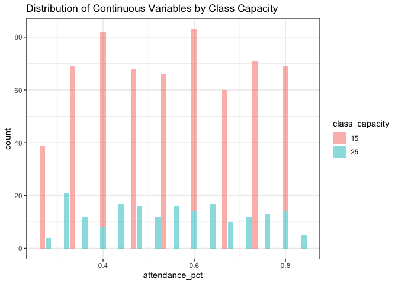

    # Remove non percentage variables
    df_trans <- 
    df_trans %>%
    select( -new_students, -over_6_month, -attendance)

As I move forward to building a model, it is important to consider how
class capacity (15 or 25) affects the relationship between our response
and predictors variables.

The next step is to explore the relationship between our predictor and
response variables. The below print out shows a glimpse of the
transformed dataset, which we will use for model development:

    glimpse(df_trans)

    ## Rows: 762
    ## Columns: 8
    ## $ class_category   <fct> Yoga, Aqua, Aqua, Strength, Yoga, HIIT, Aqua, HIIT, S…
    ## $ class_capacity   <fct> 15, 15, 15, 25, 15, 15, 25, 15, 25, 15, 15, 15, 15, 1…
    ## $ days_before      <dbl> 1, 3, 5, 3, 5, 4, 2, 1, 2, 3, 2, 1, 2, 2, 2, 4, 3, 2,…
    ## $ age              <dbl> 31.1, 27.0, 22.4, 23.5, 29.8, 28.7, 32.5, 36.0, 15.3,…
    ## $ attendance_pct   <dbl> 0.5333333, 0.5333333, 0.6666667, 0.7200000, 0.6666667…
    ## $ new_student_pct  <dbl> 0.4000000, 0.4666667, 0.5333333, 0.2800000, 0.3333333…
    ## $ over_6_month_pct <dbl> 0.2666667, 0.5333333, 0.4666667, 0.3600000, 0.4666667…
    ## $ day_time         <fct> Wed AM, Sun PM, Mon AM, Sun PM, Mon AM, Tue PM, Tue A…

## Exploratory Analysis

First in our exploratory data analysis, we’ll look at the distribution
of each continuous variable. As already stated, class capacity will be a
meaningful feature in our data so we are going to split out our density
plots by capacity. To get a sense of the sample size in each
distribution, below is the class count by class capacity:

    df_trans %>%
    count(class_capacity)

    ## # A tibble: 2 × 2
    ##   class_capacity     n
    ##   <fct>          <int>
    ## 1 15               571
    ## 2 25               191

### Continuous Variable Distribution

Let’s first look at the distribution of continuous variables. We have
four continuous predictors in our data:

1.  *Age*

2.  *Days Before*

3.  *New Student Percent*

4.  *Over 6 Month Percent*

<!-- -->

    # Distribution of continuous
    df_trans %>%
    pivot_longer(c(where(is.numeric), -starts_with("attendance")), names_to = "factor", values_to = "value") %>%
    ggplot(aes(x = value, fill = class_capacity)) +
    geom_density(alpha = 0.5) +
    theme_bw() + 
    facet_wrap(vars(factor), scales = "free") + 
    labs(title = "Distribution of Continuous Variables by Class Capacity")

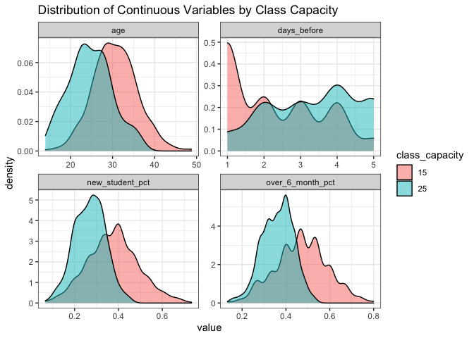

Interestingly, our distributions vary quite a bit by class capacity. It
looks like the larger classes (capacity == 25) have younger students
(age) , fill up earlier (days\_before), have fewer new students
(new\_student\_pct), and also fewer over 6 month students
(over\_6\_month\_pct).

The question to be answered next is whether the relationship between
these predictors and our attendance rate changes by capacity.

### Discrete Variable Distribution

Next, we look at the distribution of discrete variables. Just as we did
with the continuous predictors, we will split out the data by class
capacity (15 or 25). We have two discrete variables in our data:

1.  *Class Category*

2.  *Day\_time*

<!-- -->

    # Distribution of discrete
    df_trans %>%
    pivot_longer(c(where(is.factor), -class_capacity), names_to = "factor", values_to = "value") %>%
    ggplot(aes(x = value, fill = class_capacity)) +
    geom_bar(aes(y =..prop..,group = class_capacity), stat = "count", alpha = 0.5, position = "dodge", color = "grey20") +
    theme_bw() + 
    scale_y_continuous( name = "% of Total",
                        labels = scales::percent) +
    facet_wrap(vars(factor), scales = "free") +
    theme(axis.text.x = element_text(angle = 90)) +
    labs(title = "Distribution of Discrete Variables")

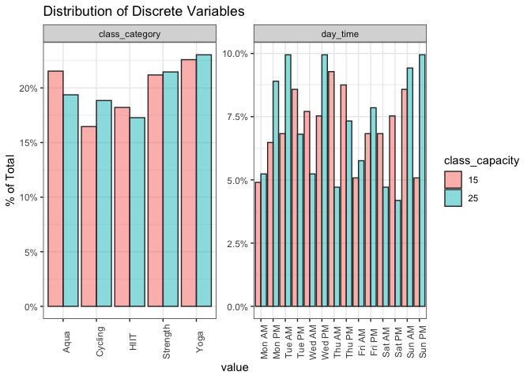

Across class category, our data set is fairly evenly distributed. All
class types are well represented. Further, there is little difference in
the distribution by class capacity.

When looking at our day\_time variable, the distibution varies over time
with classes most commonly occurring on Tuesdays, Thursdays, and
Sundays. There are minor differences in the distribution by class
capacity, but the trends are difficult to parse visually.

### Single Factor Analysis (Continuous)

For our single factor analysis, we are testing each variable in
isolation to visually evaluate whether the predictor has a relationship
with our response variable.

In addition to testing whether the relationship exists, we are looking
to see whether that relationship is linear. I’m using a scatter plot and
fitting a LOESS curve to the data. The shape of the LOESS will tell us
whether the relationship appears to be linear.

Finally, we are going to segment our data by discrete variables. What we
are looking for is whether the relationship between our ‘x’ and ‘y’
variables differ by category. For instance, does the relationship
between Age and Attendance Rate change if its a Cycling class versus a
Yoga class? This will tell us whether we can leverage interaction
factors in our model build.

    p1 <- 
    df_trans %>%
    pivot_longer(c(where(is.numeric), -starts_with("attendance")), names_to = "factor", values_to = "value") %>%
    ggplot(aes(x = value, y = attendance_pct, color = class_capacity)) +
    geom_point(alpha = 0.2) +
    theme_bw() + 
    geom_smooth(method = "loess") +
    scale_y_continuous(limits = c(0, NA)) +
    facet_wrap(vars(factor), scales = "free_x", ncol = 2) +
    ggtitle("Attendance Rate by Continous Predictor by Class Capacity")

    suppressWarnings(print(p1))

    ## `geom_smooth()` using formula 'y ~ x'

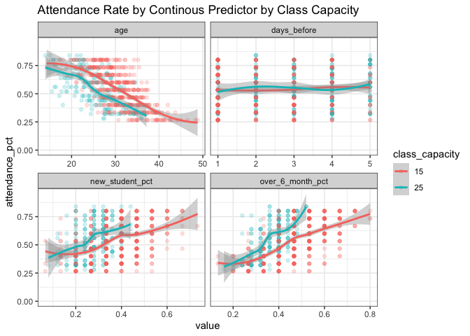

Takeaway:

-   Relationship **does** appear to be linear for all continuous
    variables

-   Relationship **does not** appear to vary by class capacity for *Age,
    Days Before, New Student Percent*

-   Relationship **does** appear to vary by class capacity for *Over 6
    Month Percent*

<!-- -->

    p2 <-
    df_trans %>%
    pivot_longer(c(where(is.numeric), -starts_with("attendance")), names_to = "factor", values_to = "value") %>%
    ggplot(aes(x = value, y = attendance_pct, color = class_category)) +
    geom_point(alpha = 0.2) +
    theme_bw() + 
    geom_smooth(method = "loess") +
    scale_y_continuous(limits = c(0, NA)) +
    facet_wrap(vars(factor), scales = "free_x", ncol = 2) +
    ggtitle("Attendance Rate by Continous Predictor by Class Category")

    suppressWarnings(print(p2))

    ## `geom_smooth()` using formula 'y ~ x'

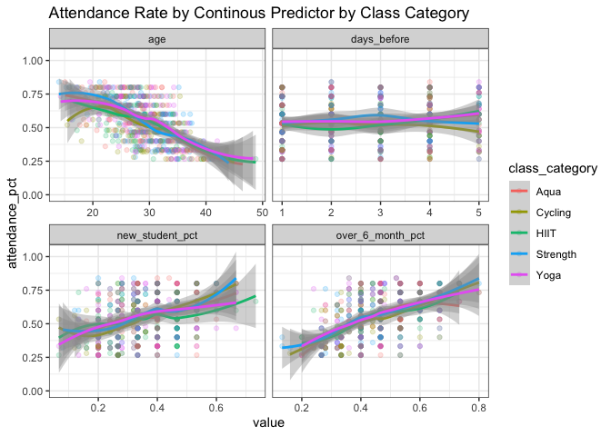

Takeaway:

-   Relationship **does** appear to be linear for all continuous
    variables

-   Relationship **does not** vary by class capacity for *Age, Days
    Before, Over 6 Month Percent*

-   Relationship between Attendance & *New Student Percent* **does**
    vary for HIIT classes versus all other class categories

### Single Factor Analysis (Discrete)

For discrete factors, we are not looking for a linear relationship
between x and y as we did with the continuous factors. In the model
building process, we are going to one hot encode these factors, so each
category will be treated as a dummy variables.

Single Factor Analysis for the discrete variables is informative only -
our model development process will not change based on the results.

    df_trans %>%
    ggplot(aes(x = day_time, y = attendance_pct)) + 
    geom_boxplot(color = "dark blue", fill = "light blue") +
    theme_bw() + 
    scale_y_continuous(limits = c(0, NA)) +
    ggtitle("Attendance Rate by Class Schedule") +
    theme(axis.text.x = element_text(angle = 90))

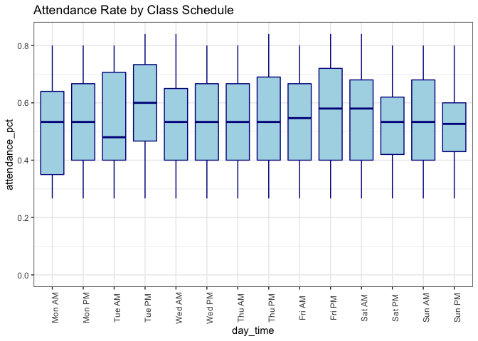

    df_trans %>%
    ggplot(aes(x = class_category, y = attendance_pct)) + 
    geom_boxplot(color = "dark green", fill = "light green") +
    theme_bw() + 
    scale_y_continuous(limits = c(0, NA)) +
    ggtitle("Attendance Rate by Class Category") +
    theme(axis.text.x = element_text(angle = 90))

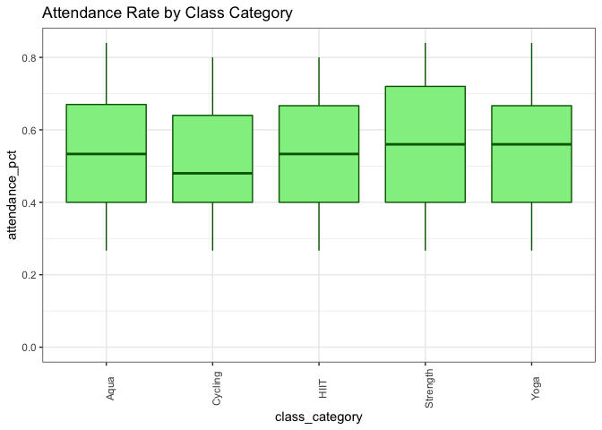

    df_trans %>%
    ggplot(aes(x = class_capacity, y = attendance_pct)) + 
    geom_boxplot(color = "dark red", fill = "pink") +
    theme_bw() + 
    scale_y_continuous(limits = c(0, NA)) +
    ggtitle("Attendance Rate by Class Capacity") +
    theme(axis.text.x = element_text(angle = 90))

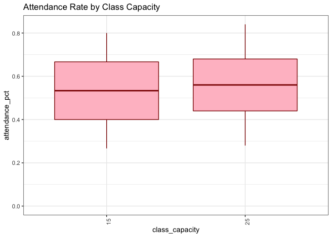

Takeaways:

-   Tuesday PMs have the highest attendance rate

-   Cycling classes have the lowest average attendance rate

-   Attendance is on average better for classes with a capacity of 25
    versus 15

## Model Fitting

Since our response variable is a real / continuous value, we look
towards regression machine learning techniques. Many different models
can are available to us, the simplest being linear regression. As shown
in the EDA, our data contains many linear relationships between the
predictor variables and the response factor, attendance rate, making a
linear model a prime candidate model.

The other model type will use to fit our data is Random Forest. Random
Forest models, when used for regression, output the average predicted
value from an ensemble of decision trees. Random Forest models excel in
regression problems if there are non-linear relationships in the data
that our simple linear regression model wouldn’t be able to capture.

Again, our EDA showed linear relationships, implying that the Random
Forest model may not perform as well as a linear model for this task.
With that said, I am selecting Random Forest as a comparison model
because it approaches the problem in a fundementally different manner.
If our conclusions from EDA are correct, I would expect that we will
proceed with the linear model. If there are non-linearity models in the
model that were overlooked in our EDA, those non-linearities would get
captured by the Random Forest model. Choosing two different approachs
helps us confirm that we are correctly specifying our model.

### Model Fitting - Data

The below section shows the model estimation results when fitting our
dependent variable, *attendance\_pct* using the following two model
types:

-   Linear Regression

-   Random Forest

Each model will be trained on a subset of the data and tested against a
hold-out subset to measure the out-of-sample performance.

    # Build the model using the raw data
    set.seed(123)
    df_split <- initial_split(df_trans, strata = attendance_pct)
    df_train <- training(df_split)
    df_test  <- testing(df_split)

### Model Fitting - Feature Engineering (Linear Model)

For the linear model, we will transform our underlying data to control
for any multicollinearity and potentially non-normality of our data. We
perform these procedures to ensure that the OLS regression assumptions
are not violated by our data. Specifically, we want to ensure that our
residuals are normally distributed and that the inter-variable
correlation is at a minumum to reduce collinearity.

In addition, we will encode our dummy variables and create the
interaction terms described in the single factor analysis.

Before estimating the linear model, we will be pre-processing our data
using the following steps:

1.  Box-Cox & Normalize all numeric variables

2.  One hot encode all categorical variables

3.  Create an interaction terms based on the trends observed in the
    single factor analysis:

    -   *class\_category\_HIIT & new\_student\_pct*
    -   *over\_6\_month\_pct & class\_capacity\_X25*

4.  Limit inter-variable correlation to 0.7 to reduce collinearity in
    the model

### Model Fitting - Feature Engineering (Random Forest)

Linear transformations of data (e.g. Box-Cox) have no value in Random
Forest models. Same is true for interaction terms. If an interaction
between two factors exists in the data, an RF model will find that
interaction without having to feature engineer.

As such, the only pre-processing steps used for the RF model is as
follows:

-   One hot encode all categorical variables

<!-- -->

    # Set up the recipe 
    df_recipe <-
      recipe(attendance_pct ~ ., data = df_train) %>%
      # normalize the data
      step_BoxCox(all_numeric_predictors()) %>% 
      step_normalize(all_numeric_predictors()) %>% 
      
      # create dummy variables
      step_dummy(all_nominal_predictors()) %>% 
      
      # create an interaction term based on SFA
      step_interact( ~ over_6_month_pct:class_capacity_X25) %>%
      step_interact( ~ new_student_pct:class_category_HIIT) %>%
      # Correlation limit
      step_corr(threshold = 0.7) %>%
      # Apply the recipe
      prep()

    # Random forest recipe. We are not using interaction terms in the RF model
    rf_recipe <-
      recipe(attendance_pct ~ ., data = df_train) %>%
      # create dummy variables
      step_dummy(all_nominal_predictors()) %>% 
      prep()

Once our data is pre-processed, we look at the correlation matrix to
understand the inter-variable correlation in our train data frame:

    # Test our variable correlation
    juice(df_recipe) %>% 
    select(-starts_with("day_time")) %>%
    corrr::correlate() %>%
    corrr::fashion()

    ## Correlation computed with
    ## • Method: 'pearson'
    ## • Missing treated using: 'pairwise.complete.obs'

    ##                                     term days_before  age new_student_pct
    ## 1                            days_before             -.16            -.08
    ## 2                                    age        -.16                 -.06
    ## 3                        new_student_pct        -.08 -.06                
    ## 4                       over_6_month_pct        -.11 -.21             .38
    ## 5                         attendance_pct         .04 -.61             .38
    ## 6                 class_category_Cycling        -.01  .00            -.12
    ## 7                    class_category_HIIT         .05 -.02             .04
    ## 8                class_category_Strength        -.05 -.01             .03
    ## 9                    class_category_Yoga        -.01  .03             .04
    ## 10                    class_capacity_X25         .32 -.44            -.40
    ## 11 over_6_month_pct_x_class_capacity_X25        -.20  .15             .35
    ## 12 new_student_pct_x_class_category_HIIT        -.07 -.00             .37
    ##    over_6_month_pct attendance_pct class_category_Cycling class_category_HIIT
    ## 1              -.11            .04                   -.01                 .05
    ## 2              -.21           -.61                    .00                -.02
    ## 3               .38            .38                   -.12                 .04
    ## 4                              .56                   -.07                -.04
    ## 5               .56                                  -.06                -.05
    ## 6              -.07           -.06                                       -.21
    ## 7              -.04           -.05                   -.21                    
    ## 8               .02            .04                   -.25                -.24
    ## 9               .06            .03                   -.24                -.23
    ## 10             -.40            .02                    .01                 .03
    ## 11              .51            .22                   -.06                -.01
    ## 12              .07            .08                   -.02                 .08
    ##    class_category_Strength class_category_Yoga class_capacity_X25
    ## 1                     -.05                -.01                .32
    ## 2                     -.01                 .03               -.44
    ## 3                      .03                 .04               -.40
    ## 4                      .02                 .06               -.40
    ## 5                      .04                 .03                .02
    ## 6                     -.25                -.24                .01
    ## 7                     -.24                -.23                .03
    ## 8                                         -.28               -.02
    ## 9                     -.28                                    .01
    ## 10                    -.02                 .01                   
    ## 11                     .03                -.01               -.66
    ## 12                    -.02                -.02               -.17
    ##    over_6_month_pct_x_class_capacity_X25 new_student_pct_x_class_category_HIIT
    ## 1                                   -.20                                  -.07
    ## 2                                    .15                                  -.00
    ## 3                                    .35                                   .37
    ## 4                                    .51                                   .07
    ## 5                                    .22                                   .08
    ## 6                                   -.06                                  -.02
    ## 7                                   -.01                                   .08
    ## 8                                    .03                                  -.02
    ## 9                                   -.01                                  -.02
    ## 10                                  -.66                                  -.17
    ## 11                                                                         .12
    ## 12                                   .12

### Model Fitting - Model Specification

With our data pre-processed, we next fit the linear and random forest
model using the training data set. We are using the *tidymodels*
workflow to fit both model types.

The linear model uses the *lm* engine while the random forest model uses
the *ranger* engine to fit the data.

    # Model Specification 
    linear_model <- linear_reg(mode = "regression", 
                               engine = "lm")

    rf_model <-    rand_forest(mode = "regression") %>% 
                    set_engine(engine = "ranger", importance = "impurity")

### Model Fitting - Results

Once the models are specified, we apply our pre-processing steps to the
data and estimate a model using the train dataset. This is done using
the code below for both the linear and RF model:

    # Linear Model
    linear_fit <- 
      workflow() %>% 
      add_recipe(df_recipe) %>% 
      add_model(linear_model) %>% 
      fit(data = df_train)

    tidy(linear_fit) %>% arrange((p.value))

    ## # A tibble: 25 × 5
    ##    term                                  estimate std.error statistic   p.value
    ##    <chr>                                    <dbl>     <dbl>     <dbl>     <dbl>
    ##  1 (Intercept)                             0.561    0.0209      26.9  4.65e-102
    ##  2 age                                    -0.0800   0.00561    -14.3  1.95e- 39
    ##  3 over_6_month_pct                        0.0595   0.00570     10.4  2.02e- 23
    ##  4 new_student_pct                         0.0380   0.00533      7.12 3.33e- 12
    ##  5 over_6_month_pct_x_class_capacity_X25   0.0382   0.0140       2.73 6.53e-  3
    ##  6 class_capacity_X25                      0.0422   0.0167       2.52 1.21e-  2
    ##  7 day_time_Sun.PM                        -0.0458   0.0258      -1.78 7.63e-  2
    ##  8 day_time_Wed.AM                        -0.0433   0.0251      -1.73 8.48e-  2
    ##  9 day_time_Thu.PM                        -0.0340   0.0242      -1.41 1.60e-  1
    ## 10 class_category_HIIT                    -0.0190   0.0142      -1.34 1.80e-  1
    ## # … with 15 more rows

    # RF Model
    rf_fit <- 
      workflow() %>% 
      add_recipe(rf_recipe) %>% 
      add_model(rf_model) %>% 
      fit(data = df_train)

    rf_fit

    ## ══ Workflow [trained] ══════════════════════════════════════════════════════════
    ## Preprocessor: Recipe
    ## Model: rand_forest()
    ## 
    ## ── Preprocessor ────────────────────────────────────────────────────────────────
    ## 1 Recipe Step
    ## 
    ## • step_dummy()
    ## 
    ## ── Model ───────────────────────────────────────────────────────────────────────
    ## Ranger result
    ## 
    ## Call:
    ##  ranger::ranger(x = maybe_data_frame(x), y = y, importance = ~"impurity",      num.threads = 1, verbose = FALSE, seed = sample.int(10^5,          1)) 
    ## 
    ## Type:                             Regression 
    ## Number of trees:                  500 
    ## Sample size:                      571 
    ## Number of independent variables:  22 
    ## Mtry:                             4 
    ## Target node size:                 5 
    ## Variable importance mode:         impurity 
    ## Splitrule:                        variance 
    ## OOB prediction error (MSE):       0.01215087 
    ## R squared (OOB):                  0.5425326

The Random Forest in-sample R-squared is 0.54, indicating relatively low
model fit. This is not a surprisingly result as our Single Factor
Analysis showed the strong linear relationship, and Random Forest models
are non-parametric in nature.

That said, the Linear and RF model will both be tested against the
hold-out data to measure performance.

## Model Evaluation

In our out-of-sample tests, we fit the test data used the trained model.
In the final step of our process, model evaluation, we compare the
predicted to actual using the hold-out data in the *df\_test* data
frame.

### Model Evaluation - Fit Statistics

The below code applies the trained models to the test data set and
compares the fit statistics of each model. The fit statistics used for
regression analysis are R-squared, MAE, and RMSE. The below table shows
the R-squared, MAE and RMSE when fitting the test data set for both the
Random Forest and linear regression model.

    linear_fit %>% 
      predict(df_test) %>% 
      bind_cols(df_test) %>% 
      metrics(truth = attendance_pct, estimate = .pred) %>% 
      mutate(model = "linear") %>% 

      union_all(

      rf_fit %>% 
      predict(df_test) %>% 
      bind_cols(df_test) %>% 
      metrics(truth = attendance_pct, estimate = .pred) %>% 
        mutate(model = "Random Forest")
      
      ) %>% 
      arrange(desc(.metric))

    ## # A tibble: 6 × 4
    ##   .metric .estimator .estimate model        
    ##   <chr>   <chr>          <dbl> <chr>        
    ## 1 rsq     standard      0.587  linear       
    ## 2 rsq     standard      0.570  Random Forest
    ## 3 rmse    standard      0.104  linear       
    ## 4 rmse    standard      0.108  Random Forest
    ## 5 mae     standard      0.0808 linear       
    ## 6 mae     standard      0.0883 Random Forest

By all three metrics (R-squared, RMSE, and MAE), the linear model
out-performs the Random Forest. For instance, the linear model’s
R-squared when predicting the data set is 0.65 compared to the Random
Forest model’s R-squared of 0.57.

### Model Evaluation - Variable Importance

Next, we can look at variable importance to see which factors are most
impactful for the linear model versus the Random Forest model. We use
the *VIP* package for this visualization.

For linear models, Importance is defined as the absolute value of the
t-statistic, implying that importance is a representation of variable
significance.

For Random Forest models, importance is calculated using the following
procedure: At each split in each tree, **the improvement in the
split-criterion is the importance measure attributed to the splitting
variable**, and is accumulated over all the trees in the forest
separately for each variable.

    rf_fit %>%
      extract_fit_parsnip() %>%
      vip::vip(geom = "col") + 
      labs(title = "Random forest variable importance") 

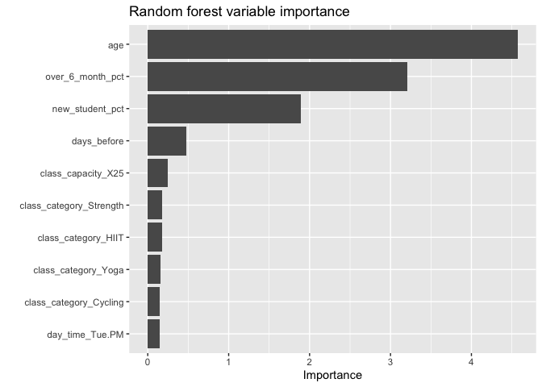

    linear_fit %>%
      extract_fit_parsnip() %>%
      vip::vip(geom = "col") +
        labs(title = "Linear Model variable importance") 

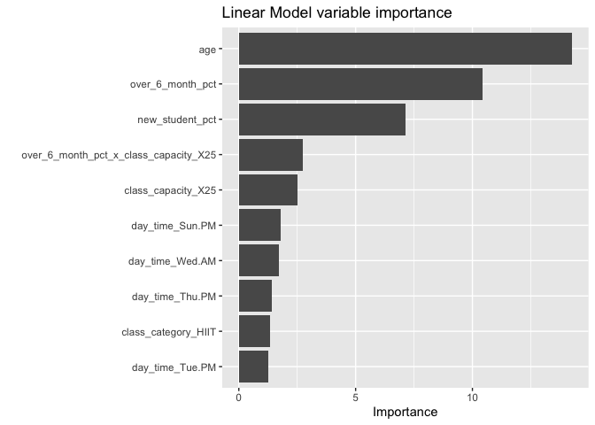

Comparing the two models, it’s clear that both model (linear and Random
Forest) relies heavily on three main factors:

1.  Age

2.  Over 6 month percent

3.  New student percent

The linear model gains some additional predictive power from the class
capacity dummy variable and that term interacted with Over 6 Month
Students Percent.

The results of the variable importance evaluations show that both models
agree in terms of which features are most important when predicting
attendance rate.

### Model Evaluation - Predicted vs. Actual

Next we compare the in-sample and out-of-sample prediction from the test
and training data sets visually. The scatter plots comparing the RF and
linear models across the test and train datasets are shown below:

    bind_rows(
      augment(linear_fit, new_data = df_train) %>% mutate(model = "lm", train = "train"),
      augment(rf_fit, new_data = df_train) %>% mutate(model = "rf", train = "train"),
      augment(linear_fit, new_data = df_test) %>% mutate(model = "lm", train = "test"),
      augment(rf_fit, new_data = df_test) %>% mutate(model = "rf", train = "test"),
    ) %>%

      ggplot(aes(attendance_pct, .pred, color = model)) +
      geom_abline(lty = 2, color = "gray80", size = 1.5) +
      geom_point(alpha = .5) +
       theme_bw() +
      facet_wrap(~ train)

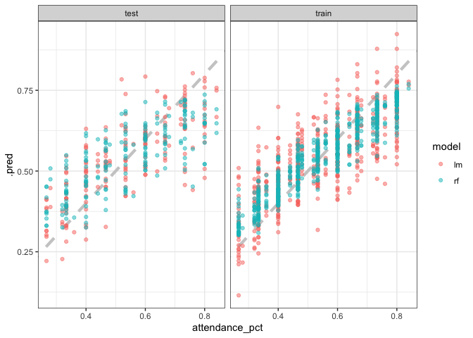

The plots show how the Random Forest model struggles to pick up the
linear relationship in both our training and testing data sets. The
linear model better captures the trend, leading to better visual fit and
better fit statistics across both data sets.

In both the test and train dataset, the Random Forest model predictions
have lower variance, but the RF model under-predicts both high and low
attendance rates.

Conversely, the linear model has higher variance in its forecasts, but
the linear model is consistent in its accuracy when attendance rate is
both high and low.

#### Model Evaluation - Predicted vs. Actual by Continuous Variable (Linear)

Next we can look at how the model forecasts compare by exogenous factor.
We start by viewing the results for the linear model:

    linear_fit %>% 
      predict(df_test) %>% 
      bind_cols(df_test) %>% 
      select(-where(is.factor)) %>% 
      pivot_longer(-c(attendance_pct, .pred)) %>% 
      pivot_longer(-c(name, value), names_to = "series", values_to = "y_value") %>% 
      ggplot(aes(x = value, y = y_value, color = series)) +
      geom_point(alpha = 0.7) +
      theme_bw() +
      ylab("Attendance Pct (%)") +
      facet_wrap(~name, scales = "free_x")+
      #theme(legend.position = "none") +
      ggtitle("Linear Model", "Model Predicted Values by Continuous Variable")

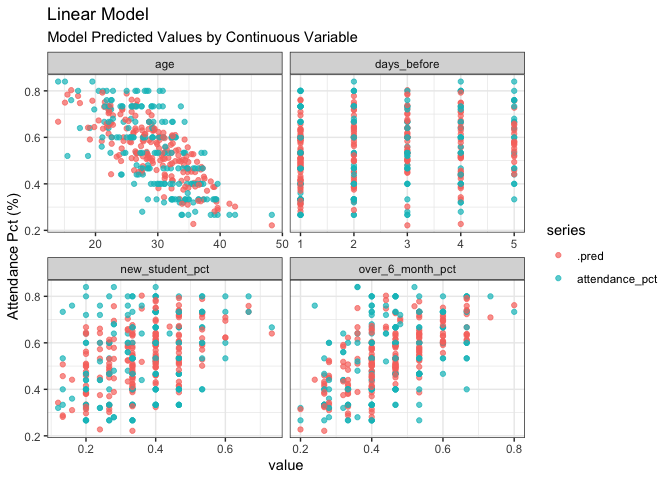

When judging performance visually, we are looking to see if the trends
between the x ~ y variables are consistent across the model predicted
and actual data sets.

Attendance percent varies linearly with Age and the linear model’s
predicted values capture trend well. The other continuous variables in
our dataset, while noisy, also show a consistent trend across the model
predicted and actual attendance percent.

#### Model Evaluation - Predicted vs. Actual by Continuous Variable (Random Forest)

Next, we apply the same visualization for the Random Forest model. As
before, we are looking to see if the trends are consistent between the
model predicted and actual attendance rates.

    rf_fit %>% 
      predict(df_test) %>% 
      bind_cols(df_test) %>% 
      select(-where(is.factor)) %>% 
      pivot_longer(-c(attendance_pct, .pred)) %>% 
      pivot_longer(-c(name, value), names_to = "series", values_to = "y_value") %>% 
      ggplot(aes(x = value, y = y_value, color = series)) +
      geom_point(alpha = 0.7) +
      theme_bw() +
      ylab("Model Predicted") +
      facet_wrap(~name, scales = "free_x")+
      scale_color_viridis_d() +
      #theme(legend.position = "none") +
      ggtitle("Random Forest Model", "Model Predicted Values by Continuous Variable")

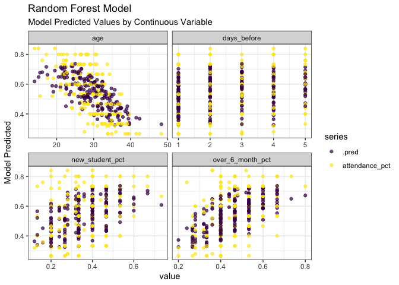

When looking at the most important feature, Age, the Random Forest model
does not capture the relationship between Age and attendance rate at the
extremes as well as the linear model. There are quite a few data points
showing that if the average age is around 20, then attendance is
expected to be around 80%. The random forest model doesn’t do a good job
distinguishing the difference in attendance rate if the average age is
25 versus if the average age is 20 or younger.

### Model Evaluation - Final

In model evaluation we judged the models on three separate criteria:

1.  Fit statistics when predicting using the test dataset
2.  Variable importance
3.  Visual assessment of predicted vs. actual scatter plots on both the
    test and train datasets

<table style="width:100%;">
<colgroup>
<col style="width: 21%" />
<col style="width: 36%" />
<col style="width: 41%" />
</colgroup>
<thead>
<tr class="header">
<th>Criteria</th>
<th>Random Forest</th>
<th>Linear Model</th>
</tr>
</thead>
<tbody>
<tr class="odd">
<td><strong>Test Fit Statistics</strong></td>
<td>RMSE = 0.1084</td>
<td>RMSE = 0.1042</td>
</tr>
<tr class="even">
<td><strong>Variable Importance</strong></td>
<td>Most Important Factors: Age Over 6 month percent New student
percent</td>
<td>Most Important Factors: Age Over 6 month percent New student
percent</td>
</tr>
<tr class="odd">
<td><strong>Predicted vs. Actual Scatter Plot</strong></td>
<td>Lower variance in model predictions, but model under-predicts both
high and low attendance rates</td>
<td>Higher variance in model predictions, but model performs
consistently when attendance rate is high and low</td>
</tr>
</tbody>
</table>

The linear model performed better in all accounts and is best suited for
modeling the class attendance.
