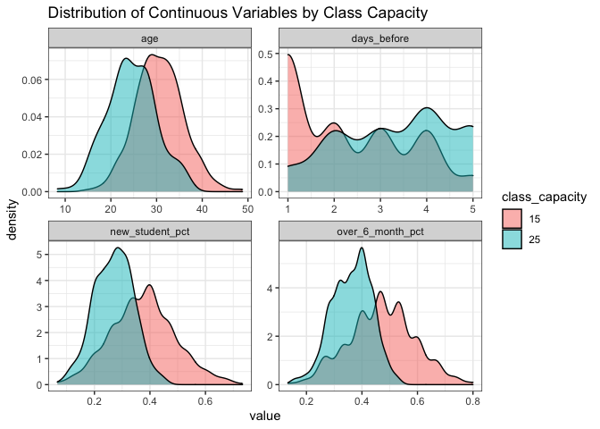
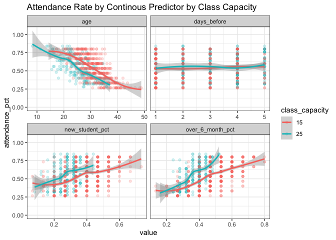
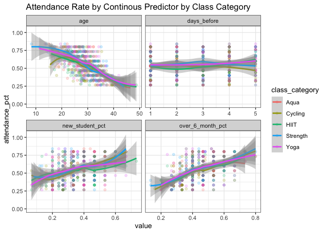
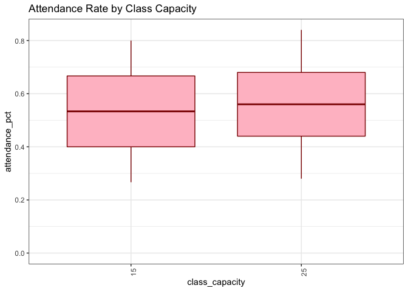
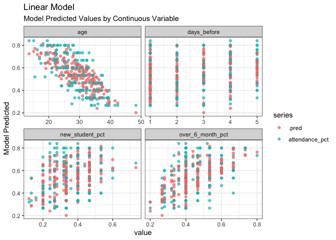
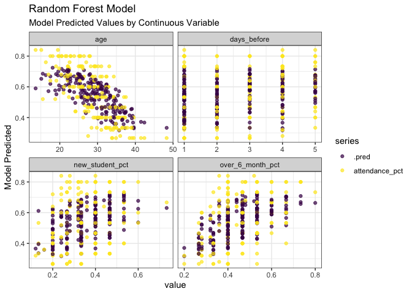
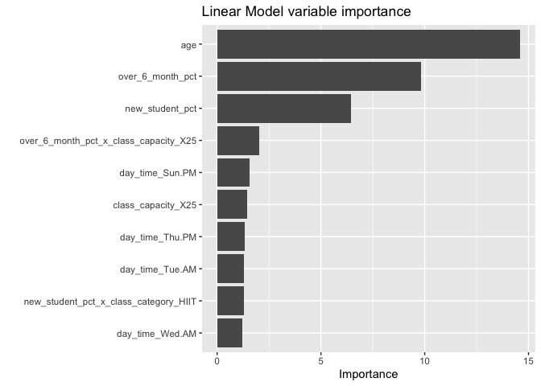

## Company Background

GoalZone is a fitness club chain providing five types of fitness classes
in Canada. Finally, the fitness classes schedule is back to normal after
the COVID-19 restrictions are lifted. However, they have received many
complaints from the customers about having a hard time booking a fitness
class.

From initial analysis, the program operation team found out that the
fitness classes are always fully booked but are having a low attendance
rate per class. To improve this situation, they would like to increase
the class capacity for customers to sign up if a low attendance rate is
predicted.

## Customer Question

The operation manager has asked you to answer the following: - Can you
predict the attendance rate for each fitness class?

## Dataset

The dataset contains the attendance information for the class scheduled
this year so far. The data you will use for this analysis can be
accessed here: `"data/fitness_class.csv"`

<table>
<colgroup>
<col style="width: 25%" />
<col style="width: 75%" />
</colgroup>
<thead>
<tr class="header">
<th>Column Name</th>
<th>Criteria</th>
</tr>
</thead>
<tbody>
<tr class="odd">
<td>Day of Week</td>
<td>Character, the day of the week the class was scheduled, one of
values from “Mon” to “Sun”.</td>
</tr>
<tr class="even">
<td>Time</td>
<td>Character, the time of the day the class was scheduled, either “AM”
or “PM”.</td>
</tr>
<tr class="odd">
<td>Class Category</td>
<td>Character, the category of the fitness class, one of “Yoga”, “Aqua”,
“Strength”, “HIIT”, or “Cycling”.</td>
</tr>
<tr class="even">
<td>Days Before</td>
<td>Numeric, number of days the class stayed fully booked, maximum five
days.</td>
</tr>
<tr class="odd">
<td>Class Capacity</td>
<td>Numeric, maximum number of members can sign up for that class,
either 15 or 25. The class capacity being 26 needs to be updated to
25.</td>
</tr>
<tr class="even">
<td>Attendance</td>
<td>Numeric, number of members actually attended the class.</td>
</tr>
<tr class="odd">
<td>Average Age</td>
<td>Numeric, average age of the members signing up for that class.
Remove rows that average age is smaller than 14 because group fitness
class are for members aged 14 and order.</td>
</tr>
<tr class="even">
<td>Number of New Students</td>
<td>Numeric, number of new students signing up for this class.</td>
</tr>
<tr class="odd">
<td>Number of Members Over 6 months</td>
<td>Numeric, number of members signing up for the class have been
joining the club more than 6 months.</td>
</tr>
</tbody>
</table>

# Data Scientist Case Study Submissi

    # Data Validation
    # Check all variables in the data against the criteria in the dataset above

    # Start coding here... 
    library(tidyverse)
    library(tidymodels)
    library(ranger)
    library(corrr)
    library(vip)
    #install.packages("ranger")
    #install.packages("corrr")
    #install.packages("vip")

    df <- read_csv("data/fitness_class.csv")
    glimpse(df)

    ## Rows: 765
    ## Columns: 9
    ## $ day_of_week    <chr> "Wed", "Sun", "Mon", "Sun", "Mon", "Tue", "Tue", "Sun",…
    ## $ time           <chr> "AM", "PM", "AM", "PM", "AM", "PM", "AM", "PM", "PM", "…
    ## $ class_category <chr> "Yoga", "Aqua", "Aqua", "Strength", "Yoga", "HIIT", "Aq…
    ## $ class_capacity <dbl> 15, 15, 15, 25, 15, 15, 25, 15, 25, 15, 15, 15, 15, 15,…
    ## $ days_before    <dbl> 1, 3, 5, 3, 5, 4, 2, 1, 2, 3, 2, 1, 2, 2, 2, 4, 3, 2, 5…
    ## $ attendance     <dbl> 8, 8, 10, 18, 10, 7, 15, 8, 20, 5, 12, 12, 9, 12, 6, 8,…
    ## $ age            <dbl> 31.1, 27.0, 22.4, 23.5, 29.8, 28.7, 32.5, 36.0, 15.3, 3…
    ## $ new_students   <dbl> 6, 7, 8, 7, 5, 4, 5, 5, 8, 4, 6, 5, 6, 6, 5, 4, 6, 7, 7…
    ## $ over_6_month   <dbl> 4, 8, 7, 9, 7, 7, 9, 7, 11, 6, 9, 8, 7, 7, 5, 8, 6, 6, …

## Data Validation

First we look at data granularity. Each row represents a class, and each
column represents an attribute of that class. For each class, we have
the following variables:

-   **day\_of\_week & time**: two generic time variable. I will look to
    re-encode both to a more typical form.
-   **class\_category**: I think its fine as is. No transformations
    needed.
-   **class\_capacity**: we can use this variable on its own and with
    attendence
-   **days\_before**: Fine as is. No transformations needed.
-   **attendence**: Will look to take the difference between attendence
    and class\_capacity: both as a number and as a percent.
-   **age**: Fine as is. No transformations
-   **new\_students**: Will look to convert this to a percent. Thinking
    % of new students in class.
-   **over\_6\_months**: Will also look to convert this as a percent.
    Also, we will need to control for overlap between this factor and
    new\_students

<!-- -->

    df_trans <-
    df %>%
    # First we are going to correct class capacity to remove any 26s 
    mutate(class_capacity = scales::squish(class_capacity, c(15,25))) %>%

    # Perform the above transformations
    mutate(day_time = paste(day_of_week, time), 
           class_category = as.factor(class_category),
           attendance_pct = attendance / class_capacity,
           new_student_pct = new_students / class_capacity,
           over_6_month_pct = over_6_month / class_capacity) %>%

    # Remove the combined time variables
    select(-day_of_week, -time) %>%

    # Order the days of the week
    mutate(day_time = factor(day_time, levels = c("Mon AM", 
                                                  "Mon PM", 
                                                  "Tue AM",
                                                  "Tue PM",
                                                  "Wed AM",
                                                  "Wed PM",
                                                  "Thu AM",
                                                  "Thu PM",
                                                  "Fri AM",
                                                  "Fri PM",
                                                  "Sat AM",
                                                  "Sat PM",
                                                  "Sun AM",
                                                  "Sun PM"))) %>%

    # Since capacity can only be 15 or 25, we are going to code it as a factor
    mutate(class_capacity = as.factor(class_capacity)) 

Let’s look at how vacancy percent is not truly continuous. There are 18
difference attendance options. Since attendance is divided by class
capacity (either 15 or 25), we have a finite number of possible
attendance percentages.

As I move forward to building a model, it is important to consider how
class capacity (15 or 25) affects the relationship between our response
and predictors variables.

    # Count by Attendance & Capacity
    df_trans %>%
    count(attendance, class_capacity) %>%
    pivot_wider(names_from = class_capacity, values_from = n, names_prefix = "capacity_") 

    ## # A tibble: 18 × 3
    ##    attendance capacity_15 capacity_25
    ##         <dbl>       <int>       <int>
    ##  1          4          39          NA
    ##  2          5          69          NA
    ##  3          6          74          NA
    ##  4          7          68           4
    ##  5          8          66          21
    ##  6          9          69          12
    ##  7         10          60           8
    ##  8         11          71          17
    ##  9         12          55          16
    ## 10         13          NA          12
    ## 11         14          NA          16
    ## 12         15          NA          14
    ## 13         16          NA          17
    ## 14         17          NA          10
    ## 15         18          NA          12
    ## 16         19          NA          13
    ## 17         20          NA          15
    ## 18         21          NA           7

    # Remove non percentage variables
    df_trans <- 
    df_trans %>%
    select( -new_students, -over_6_month, -attendance)
     
    glimpse(df_trans)

    ## Rows: 765
    ## Columns: 8
    ## $ class_category   <fct> Yoga, Aqua, Aqua, Strength, Yoga, HIIT, Aqua, HIIT, S…
    ## $ class_capacity   <fct> 15, 15, 15, 25, 15, 15, 25, 15, 25, 15, 15, 15, 15, 1…
    ## $ days_before      <dbl> 1, 3, 5, 3, 5, 4, 2, 1, 2, 3, 2, 1, 2, 2, 2, 4, 3, 2,…
    ## $ age              <dbl> 31.1, 27.0, 22.4, 23.5, 29.8, 28.7, 32.5, 36.0, 15.3,…
    ## $ day_time         <fct> Wed AM, Sun PM, Mon AM, Sun PM, Mon AM, Tue PM, Tue A…
    ## $ attendance_pct   <dbl> 0.5333333, 0.5333333, 0.6666667, 0.7200000, 0.6666667…
    ## $ new_student_pct  <dbl> 0.4000000, 0.4666667, 0.5333333, 0.2800000, 0.3333333…
    ## $ over_6_month_pct <dbl> 0.2666667, 0.5333333, 0.4666667, 0.3600000, 0.4666667…

Our cleaned and processed data set has performed the following tasks:

1.  Created a single *day\_time* variable, which we will later use as a
    categorical predictor

2.  Converted all character predictors into factors

3.  Converted *Attendance* (int) into a percentage

4.  Converted *New Students* (int) into a percentage

5.  Converted *Over 6 Month* (int) into a percentage

The next step is to explore the relationship between our predictor and
response variables.

## Exploratory Analysis

First things first, let’s look at the distribution of each continuous
variable. As already stated, class capacity should be a pretty important
factor in our data so we are going to split out our density plots by
capacity. To get a sense of the sample size in each distribution, below
is the class count by class capacity:

    df_trans %>%
    count(class_capacity)

    ## # A tibble: 2 × 2
    ##   class_capacity     n
    ##   <fct>          <int>
    ## 1 15               571
    ## 2 25               194

### Continuous Variable Distribution

Let’s first look at the distribution of continuous variables. We have
four continuous predictors in our data:

1.  *Age*

2.  *Days Before*

3.  *New Student Percent*

4.  *Over 6 Month Percent*

<!-- -->

    # Distribution of continuous
    df_trans %>%
    pivot_longer(c(where(is.numeric), -starts_with("attendance")), names_to = "factor", values_to = "value") %>%
    ggplot(aes(x = value, fill = class_capacity)) +
    geom_density(alpha = 0.5) +
    theme_bw() + 
    facet_wrap(vars(factor), scales = "free") + 
    labs(title = "Distribution of Continuous Variables by Class Capacity")

Interestingly and frankly surprisingly, our distributions vary quite a
bit by class capacity. It looks like the larger classes (capacity == 25)
have younger students (age) , fill up earlier (days\_before), have fewer
new students (new\_student\_pct), and also fewer over 6 month students
(over\_6\_month\_pct).

The question to be answered next is whether the relationship between
these predictors and our attendance rate changes by capacity.

### Discrete Variable Distribution

Next, we look at the distribution of discrete variables. Just as we did
with the continuous predictors, we will split out the data by class
capacity (15 or 25). We have two discrete variables in our data:

1.  *Class Category*

2.  *Day\_time*

<!-- -->

    # Distribution of discrete
    df_trans %>%
    pivot_longer(c(where(is.factor), -class_capacity), names_to = "factor", values_to = "value") %>%
    ggplot(aes(x = value, fill = class_capacity)) +
    geom_bar(aes(y =..prop..,group = class_capacity), stat = "count", alpha = 0.5, position = "dodge", color = "grey20") +
    theme_bw() + 
    scale_y_continuous( name = "% of Total",
                        labels = scales::percent) +
    facet_wrap(vars(factor), scales = "free") +
    theme(axis.text.x = element_text(angle = 90)) +
    labs(title = "Distribution of Discrete Variables")

Across class category, our data set is fairly evenly distributed. All
class types are well represented. Further, there is little difference in
the distribution by class capacity.

When looking at our day\_time variable, the distibution varies over time
with classes most commonly occurring on Tuesdays, Thursdays, and
Sundays. There are minor differences in the distribution by class
capacity, but the trends are difficult to parse visually.

### Single Factor Analysis (Continuous)

For our single factor analysis, we are testing each variable in
isolation to visually evaluate whether the predictor has a relationship
with our response variable.

In addition to testing whether the relationship exists, we are looking
to see whether that relationship is linear. I’m using a scatter plot and
fitting a LOESS curve to the data. The shape of the LOESS will tell us
whether the relationship appears to be linear.

Finally, we are going to segment our data by discrete variables. What we
are looking for is whether the relationship between our ‘x’ and ‘y’
variables differ by category. For instance, does the relationship
between Age and Attendance Rate change if its a Cycling class versus a
Yoga class? This will tell us whether we can leverage interaction
factors in our model build.

    ## `geom_smooth()` using formula 'y ~ x'

Takeaway:

-   Relationship appears to be linear for all continuous variables

-   Relationship does not vary by class capacity for *Age, Days Before,
    New Student Percent*

-   Relationship does vary by class capacity for *Over 6 Month Percent*

<!-- -->

    df_trans %>%
    pivot_longer(c(where(is.numeric), -starts_with("attendance")), names_to = "factor", values_to = "value") %>%
    ggplot(aes(x = value, y = attendance_pct, color = class_category)) +
    geom_point(alpha = 0.2) +
    theme_bw() + 
    geom_smooth(method = "loess") +
    scale_y_continuous(limits = c(0, NA)) +
    facet_wrap(vars(factor), scales = "free_x", ncol = 2) +
    ggtitle("Attendance Rate by Continous Predictor by Class Category")

    ## `geom_smooth()` using formula 'y ~ x'

Takeaway:

-   Relationship appears to be linear for all continuous variables

-   Relationship does not vary by class capacity for *Age, Days Before,
    Over 6 Month Percent*

-   Relationship between Attendance & *New Student Percent* is
    meaningfully lower for HIIT classes versus all other class
    categories

### Single Factor Analysis (Discrete)

For discrete factors, we are not looking for a linear relationship
between x and y as we did with the continuous factors. In the model
building process, we are going to one hot encode these factors, so each
category will be treated as a dummy variables.

Single Factor Analysis for the discrete variables is informative only -
our model development process will not change based on the results.

    df_trans %>%
    ggplot(aes(x = day_time, y = attendance_pct)) + 
    geom_boxplot(color = "dark blue", fill = "light blue") +
    theme_bw() + 
    scale_y_continuous(limits = c(0, NA)) +
    ggtitle("Attendance Rate by Class Schedule") +
    theme(axis.text.x = element_text(angle = 90))

    df_trans %>%
    ggplot(aes(x = class_category, y = attendance_pct)) + 
    geom_boxplot(color = "dark green", fill = "light green") +
    theme_bw() + 
    scale_y_continuous(limits = c(0, NA)) +
    ggtitle("Attendance Rate by Class Category") +
    theme(axis.text.x = element_text(angle = 90))

    df_trans %>%
    ggplot(aes(x = class_capacity, y = attendance_pct)) + 
    geom_boxplot(color = "dark red", fill = "pink") +
    theme_bw() + 
    scale_y_continuous(limits = c(0, NA)) +
    ggtitle("Attendance Rate by Class Capacity") +
    theme(axis.text.x = element_text(angle = 90))

Takeaways:

-   Tuesday PMs have the highest attendance rate

-   Cycling classes have the lowest average attendance rate

-   Attendance is on average better for classes with a capacity of 25
    versus 15

## Model Fitting

We are going to fit three different model types to fit our dependent
variable, *attendance\_pct*.

-   Linear Regression

-   Random Forest

Each model will be trained on a subset of the data and tested against a
hold-out subset to measure the out-of-sample performance.

    # Build the model using the raw data
    set.seed(123)
    df_split <- initial_split(df_trans, strata = attendance_pct)
    df_train <- training(df_split)
    df_test  <- testing(df_split)

Before estimating each model, we will be pre-processing our data using
the following steps:

1.  Box-Cox & Normalize all numeric variables

2.  One hot encode all categorical variables

3.  Create an interaction terms based on the trends observed in the
    single factor analysis:

    1.  *class\_category\_HIIT & new\_student\_pct*

    2.  *over\_6\_month\_pct & class\_capacity\_X25*

4.  Limit inter-variable correlation to 0.7 to reduce collinearity in
    the model

Steps 1:3 will be applied to all models (Linear, Random Forest,
XGBoost). We don’t need interaction terms in the tree-based models (RF),
so we have a separate set of pre-processing steps for those models.

    # Set up the recipe 
    df_recipe <-
      recipe(attendance_pct ~ ., data = df_train) %>%
      # normalize the data
      step_BoxCox(all_numeric_predictors()) %>% 
      step_normalize(all_numeric_predictors()) %>% 
      
      # create dummy variables
      step_dummy(all_nominal_predictors()) %>% 
      
      # create an interaction term based on SFA
      step_interact( ~ over_6_month_pct:class_capacity_X25) %>%
      step_interact( ~ new_student_pct:class_category_HIIT) %>%
      # Correlation limit
      step_corr(threshold = 0.7) %>%
      # Apply the recipe
      prep()

    # Random forest recipe. We are not using interaction terms in the RF model
    rf_recipe <-
      recipe(attendance_pct ~ ., data = df_train) %>%
      # normalize the data
      step_YeoJohnson(all_numeric_predictors()) %>% 
      step_normalize(all_numeric_predictors()) %>% 
      # create dummy variables
      step_dummy(all_nominal_predictors()) %>% 
      prep()

Once our data is pre-processed, I look at the correlation matrix to
understand the inter-variable correlation in our train data frame:

    # Test our variable correlation
    juice(df_recipe) %>% 
    select(-starts_with("day_time")) %>%
    corrr::correlate() %>%
    corrr::fashion()

    ## Correlation computed with
    ## • Method: 'pearson'
    ## • Missing treated using: 'pairwise.complete.obs'

    ##                                     term days_before  age new_student_pct
    ## 1                            days_before             -.16            -.08
    ## 2                                    age        -.16                 -.06
    ## 3                        new_student_pct        -.08 -.06                
    ## 4                       over_6_month_pct        -.12 -.21             .40
    ## 5                         attendance_pct         .03 -.61             .37
    ## 6                 class_category_Cycling        -.00  .01            -.11
    ## 7                    class_category_HIIT         .05 -.02             .04
    ## 8                class_category_Strength        -.05 -.02             .03
    ## 9                    class_category_Yoga        -.02  .00             .04
    ## 10                    class_capacity_X25         .34 -.44            -.41
    ## 11 over_6_month_pct_x_class_capacity_X25        -.22  .15             .36
    ## 12 new_student_pct_x_class_category_HIIT        -.06 -.01             .39
    ##    over_6_month_pct attendance_pct class_category_Cycling class_category_HIIT
    ## 1              -.12            .03                   -.00                 .05
    ## 2              -.21           -.61                    .01                -.02
    ## 3               .40            .37                   -.11                 .04
    ## 4                              .56                   -.07                -.01
    ## 5               .56                                  -.08                -.02
    ## 6              -.07           -.08                                       -.21
    ## 7              -.01           -.02                   -.21                    
    ## 8               .03            .04                   -.25                -.25
    ## 9               .02            .03                   -.24                -.24
    ## 10             -.40            .01                    .02                 .01
    ## 11              .51            .21                   -.06                 .00
    ## 12              .10            .08                   -.02                 .08
    ##    class_category_Strength class_category_Yoga class_capacity_X25
    ## 1                     -.05                -.02                .34
    ## 2                     -.02                 .00               -.44
    ## 3                      .03                 .04               -.41
    ## 4                      .03                 .02               -.40
    ## 5                      .04                 .03                .01
    ## 6                     -.25                -.24                .02
    ## 7                     -.25                -.24                .01
    ## 8                                         -.28               -.01
    ## 9                     -.28                                    .03
    ## 10                    -.01                 .03                   
    ## 11                     .03                -.03               -.67
    ## 12                    -.02                -.02               -.17
    ##    over_6_month_pct_x_class_capacity_X25 new_student_pct_x_class_category_HIIT
    ## 1                                   -.22                                  -.06
    ## 2                                    .15                                  -.01
    ## 3                                    .36                                   .39
    ## 4                                    .51                                   .10
    ## 5                                    .21                                   .08
    ## 6                                   -.06                                  -.02
    ## 7                                    .00                                   .08
    ## 8                                    .03                                  -.02
    ## 9                                   -.03                                  -.02
    ## 10                                  -.67                                  -.17
    ## 11                                                                         .11
    ## 12                                   .11

With our data pre-processed, we next fit the linear and random forest
model. We are using the *tidymodels* workflow to fit both model types:

    # Model Specification 
    linear_model <- linear_reg(mode = "regression", 
                               engine = "lm")

    rf_model <-    rand_forest(mode = "regression") %>% 
                    set_engine(engine = "ranger", importance = "impurity")

    #use the knn spec to fit the pre-processed training data
    linear_fit <- 
      workflow() %>% 
      add_recipe(df_recipe) %>% 
      add_model(linear_model) %>% 
      fit(data = df_train)

    print(tidy(linear_fit)) 

    ## # A tibble: 25 × 5
    ##    term                     estimate std.error statistic  p.value
    ##    <chr>                       <dbl>     <dbl>     <dbl>    <dbl>
    ##  1 (Intercept)              0.564      0.0218     25.9   3.75e-97
    ##  2 days_before              0.000689   0.00470     0.147 8.83e- 1
    ##  3 age                     -0.0833     0.00571   -14.6   5.76e-41
    ##  4 new_student_pct          0.0354     0.00547     6.47  2.22e-10
    ##  5 over_6_month_pct         0.0575     0.00587     9.81  5.09e-21
    ##  6 class_category_Cycling  -0.0123     0.0143     -0.858 3.91e- 1
    ##  7 class_category_HIIT     -0.0118     0.0143     -0.829 4.07e- 1
    ##  8 class_category_Strength  0.00311    0.0134      0.231 8.17e- 1
    ##  9 class_category_Yoga      0.00371    0.0136      0.272 7.86e- 1
    ## 10 class_capacity_X25       0.0253     0.0173      1.46  1.44e- 1
    ## # … with 15 more rows

    rf_fit <- 
      workflow() %>% 
      add_recipe(rf_recipe) %>% 
      add_model(rf_model) %>% 
      fit(data = df_train)

    print((rf_fit))

    ## ══ Workflow [trained] ══════════════════════════════════════════════════════════
    ## Preprocessor: Recipe
    ## Model: rand_forest()
    ## 
    ## ── Preprocessor ────────────────────────────────────────────────────────────────
    ## 3 Recipe Steps
    ## 
    ## • step_YeoJohnson()
    ## • step_normalize()
    ## • step_dummy()
    ## 
    ## ── Model ───────────────────────────────────────────────────────────────────────
    ## Ranger result
    ## 
    ## Call:
    ##  ranger::ranger(x = maybe_data_frame(x), y = y, importance = ~"impurity",      num.threads = 1, verbose = FALSE, seed = sample.int(10^5,          1)) 
    ## 
    ## Type:                             Regression 
    ## Number of trees:                  500 
    ## Sample size:                      573 
    ## Number of independent variables:  22 
    ## Mtry:                             4 
    ## Target node size:                 5 
    ## Variable importance mode:         impurity 
    ## Splitrule:                        variance 
    ## OOB prediction error (MSE):       0.01253405 
    ## R squared (OOB):                  0.5307238

The Random Forest in-sample R-squared is 0.53, indicating relatively low
model fit. This is not a surprisingly result as our Single Factor
Analysis showed the strong linear relationship, and Random Forest models
are non-parametric in nature.

That said, the Linear and RF model will both be tested against the
hold-out data to measure performance.

## Model Evaluation

In our out-of-sample tests, we fit the test data used the trained model.
Then we compare the predicted to actual using our testing samples.

First, let’s look at the out-of-sample fit statistics:

    linear_fit %>% 
      predict(df_test) %>% 
      bind_cols(df_test) %>% 
      metrics(truth = attendance_pct, estimate = .pred) %>% 
      mutate(model = "linear") %>% 

      union_all(

      rf_fit %>% 
      predict(df_test) %>% 
      bind_cols(df_test) %>% 
      metrics(truth = attendance_pct, estimate = .pred) %>% 
        mutate(model = "Random Forest")
      
      ) %>% 
      arrange(desc(.metric))

    ## # A tibble: 6 × 4
    ##   .metric .estimator .estimate model        
    ##   <chr>   <chr>          <dbl> <chr>        
    ## 1 rsq     standard      0.651  linear       
    ## 2 rsq     standard      0.575  Random Forest
    ## 3 rmse    standard      0.0969 linear       
    ## 4 rmse    standard      0.109  Random Forest
    ## 5 mae     standard      0.0780 linear       
    ## 6 mae     standard      0.0917 Random Forest

By all three metrics (R-squared, RMSE, and MAE), the linear model
out-performs the Random Forest.

Visually, the in-sample and out-of-sample prediction plots are shown
below:

     bind_rows(
      augment(linear_fit, new_data = df_train) %>% mutate(model = "lm", train = "train"),
      augment(rf_fit, new_data = df_train) %>% mutate(model = "rf", train = "train"),
      augment(linear_fit, new_data = df_test) %>% mutate(model = "lm", train = "test"),
      augment(rf_fit, new_data = df_test) %>% mutate(model = "rf", train = "test"),
    ) %>%

      ggplot(aes(attendance_pct, .pred, color = model)) +
      geom_abline(lty = 2, color = "gray80", size = 1.5) +
      geom_point(alpha = .5) +
       theme_bw() +
      facet_wrap(~ train)

The plots show how the Random Forest model struggles to pick up the
linear relationship in both our training and testing data sets. The
linear model better captures the trend, leading to better visual fit and
better fit statistics across both data sets.

The linear model’s R-squared in the test data set is 0.65 compared to
the Random Forest model’s R-squared of 0.57.

### Predicted vs. Actual by Continuous Variable

Next we can look at how the model forecasts compare by exogenous factor.
We start by viewing the results for the linear model:

    linear_fit %>% 
      predict(df_test) %>% 
      bind_cols(df_test) %>% 
      select(-where(is.factor)) %>% 
      pivot_longer(-c(attendance_pct, .pred)) %>% 
      pivot_longer(-c(name, value), names_to = "series", values_to = "y_value") %>% 
      ggplot(aes(x = value, y = y_value, color = series)) +
      geom_point(alpha = 0.7) +
      theme_bw() +
      ylab("Model Predicted") +
      facet_wrap(~name, scales = "free_x")+
      #theme(legend.position = "none") +
      ggtitle("Linear Model", "Model Predicted Values by Continuous Variable")

Information between each x ~ y variable is captured well by the linear
model.

Next, we apply the same visualization for the Random Forest model:

    rf_fit %>% 
      predict(df_test) %>% 
      bind_cols(df_test) %>% 
      select(-where(is.factor)) %>% 
      pivot_longer(-c(attendance_pct, .pred)) %>% 
      pivot_longer(-c(name, value), names_to = "series", values_to = "y_value") %>% 
      ggplot(aes(x = value, y = y_value, color = series)) +
      geom_point(alpha = 0.7) +
      theme_bw() +
      ylab("Model Predicted") +
      facet_wrap(~name, scales = "free_x")+
      scale_color_viridis_d() +
      #theme(legend.position = "none") +
      ggtitle("Random Forest Model", "Model Predicted Values by Continuous Variable")

### Variable Importance

Finally, we can look at variable importance to see which factors are
most impactful for the linear model versus the Random Forest model. We
use the *VIP* package for this visualization.

For linear models, Importance is defined as the absolute value of the
t-statistic, implying that importance is a representation of variable
significance.

For Random Forest models, importance is calculated using the following
procedure: At each split in each tree, **the improvement in the
split-criterion is the importance measure attributed to the splitting
variable**, and is accumulated over all the trees in the forest
separately for each variable.

    rf_fit %>%
      extract_fit_parsnip() %>%
      vip(geom = "col") + 
      labs(title = "Random forest variable importance") 

Comparing the two models, it’s clear that the Random Forest model relies
heavily on three main factors:

1.  Age

2.  Over 6 month percent

3.  New student percent

All other factors have little importance in the Random Forest model.

For comparison, the linear importance plot is shown below:

    linear_fit %>%
      extract_fit_parsnip() %>%
      vip::vip(geom = "col") +
        labs(title = "Linear Model variable importance") 

## Conclusion

In fitting a Random Forest model and a linear model to predict
attendance rates, the linear model performs the best in capturing the
trends in our predictor data.
